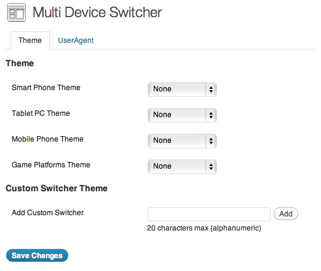
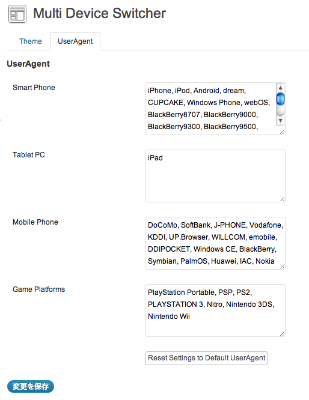
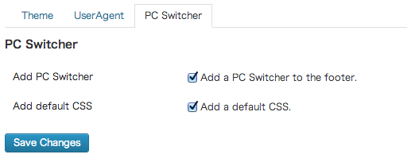
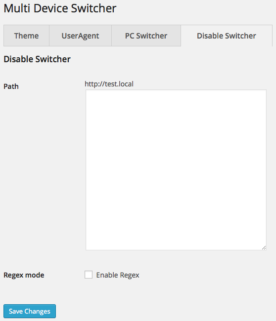

# Introducing Multi Device Switcher

This WordPress plugin allows you to set a separate theme for device (Smart Phone, Tablet PC, Mobile Phone, Game and custom).
This plugin detects if your site is being viewed by UserAgent, and switches to selected theme. The Custom Switcher can add every device.

## Features

- Set a separate theme for device (Smart Phone, Tablet PC, Mobile Phone, Game), switches to selected theme.
- Add every device by the **Custom Switcher**.
- Add links 'Mobile' or 'PC' in the theme by the **PC Switcher**, switch to the default theme.
- Switch the content of the post or page for each device by the **Display Switcher** Shortcode.
- Disable the switching of the theme by a particular URL by the **Disable Switcher**.
- Can be using is_multi_device() function that detect of the device.
- **Multi Device Switcher Command** command-line tool (required WP-CLI)

## How do I use it ?

1. Download and unzip files. Or install multi-device-switcher using the WordPress plugin installer. In that case, skip 2.
2. Upload "multi-device-switcher" to the "/wp-content/plugins/" directory.
3. Activate the plugin through the 'Plugins' menu in WordPress.
4. Upload a separate theme to the "/wp-content/themes/" directory.
5. Go to the "Multi Device Switcher" options page through the 'Appearance' menu in WordPress.
6. Configure settings to your needs. Select Theme by Theme option. Add and fix UserAgent by UserAgent option if necessary.
7. Have fun!

## Screenshot







## How to add the Custom Switcher

1. Go to the "Multi Device Switcher" options page through the 'Appearance' menu in WordPress.
2. Enter the name of the Custom Switcher (20 characters max, alphanumeric) to the 'Add Custom Switcher'. Push the button 'Add'.
3. Configure settings. Select Theme by Theme option. Add UserAgent by UserAgent option.
4. Have fun!

## Setting and Using the PC Switcher

There are three ways how to Using the PC Switcher.


### 1. Add a PC Switcher to the footer

1. Go to the "Multi Device Switcher" options page through the 'Appearance' menu in WordPress.
2. Configure settings. Check the checkbox 'Add a PC Switcher to the footer.' by PC Switcher option.
3. Have fun!

### 2. Add a PC Switcher to your sidebars/widget areas

1. Add-on the widget 'PC Switcher', when you activate the plugin "Multi Device Switcher".
2. Go to the "Widgets" options page through the 'Appearance' menu in WordPress.
3. Drag and drop the title bars 'PC Switcher' into the desired area.
4. Have fun!

### 3. For the theme authors and developers, add a PC Switcher to your theme.

1. Add the following code into the PHP files, when you develop your theme.
```
<?php if ( function_exists('multi_device_switcher_add_pc_switcher') ) { multi_device_switcher_add_pc_switcher(); } ?>
```
2. Have fun!

### Using default CSS and customized CSS

1. Go to the "Multi Device Switcher" options page through the 'Appearance' menu in WordPress.
2. Configure settings. Check the checkbox 'Add a default CSS.' by PC Switcher option. If you want to customize CSS, uncheck the checkbox.
3. Have fun!

You can design the PC Switcher in the Style Sheet.

#### HTML output of the PC Switcher

```
 <div class="pc-switcher"><span class="active">Mobile</span><a href="http://DOMEIN/PATH/TO/?pc-switcher=1">PC</a></div>
```

#### HTML output of the PC Switcher when switched

```
 <div class="pc-switcher"><a href="http://DOMEIN/PATH/TO/?pc-switcher=0">Mobile</a><span class="active">PC</span></div>
```

## How to use the Display Switcher Shortcode

The **Display Switcher** Shortcode switch the content of the post or page through the detection of the device.

Add the shortcode `[multi]` in a post or page and use the `device` attribute to device name. if the device attribute is empty, detect the desktop PC.

### Attributes

**device**

(string | empty) The name of the device

* smart
* tablet
* mobile
* game
* the name of the Custom Switcher

if empty, detect the desktop PC

### Example Shortcode

```
[multi]pc or other specific stuff here[/multi]
[multi device="smart"]smartphone specific stuff here[/multi]
[multi device="tablet"]tablet specific stuff here[/multi]
[multi device="test"]test Custom Switcher specific stuff here[/multi]
```

For theme or plugin developers. Filters The Display Switcher Shortcode through hooks. In that case, edit theme or plugin files.

```
<?php
echo do_shortcode('[multi device="smart"]smartphone specific stuff here[/multi]');
?>
```

## How to use the Disable Switcher

The **Disable Switcher** disable the switching of the theme by a particular URL. If you match the access the url and a string or a regular expression (Regex mode), disable the switching of the theme. Regex mode is for advanced users.

1. Go to the "Multi Device Switcher" options page through the 'Appearance' menu in WordPress.
2. Enter the path to the line by line where you want to disable by Disable Switcher option. Check the checkbox 'Enable Regex', if you want to use a regular expression.
3. Have fun!

### Example

```
/sample-page
/2015/01/hello-world
```

##### Regex mode (in the case of regular expression)

```
\/sample\-
\/2015\/01
```

## UserAgent option Samples

* [Default UserAgent](https://github.com/thingsym/multi-device-switcher/wiki/Default-UserAgent)


## Detect the device by JavaScript

Multi Device Switcher set the Cookie that holds the state of the switch. You can get the Cookie and detect the device by JavaScript.

### Cookies

* `multi-device-switcher` The name of the device is switched (value: null | device name)
* `disable-switcher` State of disabled (value: null | 1)
* `pc-switcher` State of the PC Switcher when switched (value: null | 1)

### Example

```
 <script src="http://DOMEIN/PATH/TO/jquery.cookie.js"></script>
 <script>
 (function($) {
 	$(function() {
 		if ( $.cookie( 'multi-device-switcher' ) == 'smart' ) {
 			/* smartphone specific stuff here */
 		} else if ( $.cookie( 'multi-device-switcher' ) == 'tablet' ) {
 			/* tablet specific stuff here */
 		} else {
 			/* pc or other specific stuff here */
 		}
 	});
 })(jQuery);
 </script>
```

## is_multi_device() function

**is_multi_device()** function is a boolean function, meaning it returns either TRUE or FALSE. Works through the detection of the device by the Multi_Device_Switcher class.

### Usage

```
<?php is_multi_device('smart'); ?>
```

### Example

```
<?php
if ( function_exists( 'is_multi_device' ) ) {
	if ( is_multi_device('smart') ) {
		/* Display and echo smartphone specific stuff here */
	} elseif ( is_multi_device('tablet') ) {
		/* Display and echo tablet specific stuff here */
	} else {
		/* Display and echo pc or other specific stuff here */
	}
}
?>
```

### Parameters

**device name** (required)

(string) The name of the device

* smart
* tablet
* mobile
* game
* the name of the Custom Switcher

### Return Values

(boolean) Return boolean whether a particular device.

## is_pc_switcher() function

**is_pc_switcher()** function is a boolean function, meaning it returns either TRUE or FALSE. Return the the state of PC Switcher by the Multi_Device_Switcher class. Return true if the theme has switched by the PC Switcher.

### Usage

```
<?php is_pc_switcher(); ?>
```

### Example

```
<?php
if ( function_exists( 'is_pc_switcher' ) ) {
	if ( is_pc_switcher() ) {
		/* Theme switched by the PC Switcher. Display and echo specific stuff here */
	} else {
		/* Display and echo specific stuff here */
	}
}
?>
```

### Parameters

None

### Return Values

(boolean) Return the state of PC Switcher.


## is_disable_switcher() function

**is_disable_switcher()** function is a boolean function, meaning it returns either TRUE or FALSE. Return the state of disabled by the Multi_Device_Switcher class.

### Usage

```
<?php is_disable_switcher(); ?>
```

### Example

```
<?php
if ( function_exists( 'is_disable_switcher' ) ) {
	if ( is_disable_switcher() ) {
		/* Disabled. Display and echo specific stuff here */
	} else {
		/* Display and echo specific stuff here */
	}
}
?>
```

### Parameters

None

### Return Values

(boolean) Return the state of disabled.

## Multi Device Switcher Command

The **Multi Device Switcher Command** is command-line tool.

Add-on the Multi Device Switcher Command, when you activate the plugin "Multi Device Switcher". To use the Multi Device Switcher Command is WP-CLI required.

### NAME

	wp multi-device

### DESCRIPTION

	Multi Device Switcher Command

### SYNOPSIS

	wp multi-device <command>

### SUBCOMMANDS

	add              add Custom Switcher
	css              turn on/off default CSS
	delete           delete Custom Switcher
	pc-switcher      turn on/off PC Switcher
	reset            reset Settings to Default UserAgent
	status           get status of settings
	theme            get or switch a theme
	useragent        get or set UserAgent


For more information about the Multi Device Switcher Command, see `wp help multi-device <SUBCOMMANDS>`.


### Command examples

get status of settings

	wp multi-device status

	Active Theme: Twenty Fifteen | twentyfifteen
	+--------------------------+-----------------+----------------+-------------------------------------------------------------------------+
	| Device                   | Theme           | Slug           | UserAgent                                                               |
	+--------------------------+-----------------+----------------+-------------------------------------------------------------------------+
	| smartphone (Smart Phone) | Twenty Fourteen | twentyfourteen | iPhone, iPod, Android, dream, CUPCAKE, Windows Phone, webOS, BB10, Blac |
	|                          |                 |                | kBerry8707, BlackBerry9000, BlackBerry9300, BlackBerry9500, BlackBerry9 |
	|                          |                 |                | 530, BlackBerry9520, BlackBerry9550, BlackBerry9700, BlackBerry 93, Bla |
	|                          |                 |                | ckBerry 97, BlackBerry 99, BlackBerry 98                                |
	| tablet (Tablet PC)       | Twenty Thirteen | twentythirteen | iPad, Kindle, Sony Tablet, Nexus 7                                      |
	| mobile (Mobile Phone)    | Twenty Twelve   | twentytwelve   | DoCoMo, SoftBank, J-PHONE, Vodafone, KDDI, UP.Browser, WILLCOM, emobile |
	|                          |                 |                | , DDIPOCKET, Windows CE, BlackBerry, Symbian, PalmOS, Huawei, IAC, Noki |
	|                          |                 |                | a                                                                       |
	| game (Game Platforms)    | Twenty Eleven   | twentyeleven   | PlayStation Portable, PlayStation Vita, PSP, PS2, PLAYSTATION 3, PlaySt |
	|                          |                 |                | ation 4, Nitro, Nintendo 3DS, Nintendo Wii, Nintendo WiiU, Xbox         |
	+--------------------------+-----------------+----------------+-------------------------------------------------------------------------+
	PC Switcher: on
	default CSS: on

switch twentyfifteen in theme of smartphone using theme slug

    wp multi-device theme smartphone twentyfifteen

set UserAgent in theme of tablet

    wp multi-device useragent tablet 'iPad, Kindle, Sony Tablet, Nexus 7'

add example Custom Switcher

    wp multi-device add example

add example Custom Switcher. set twentyfifteen theme and UserAgent using theme slug

    wp multi-device add example twentyfifteen 'iPad, Kindle, Sony Tablet, Nexus 7'

delete example Custom Switcher

    wp multi-device delete example

turn on default CSS

    wp multi-device css on

## Contributing

### Patches and Bug Fixes

Small patches and bug reports can be submitted a issue tracker in Github. Forking on Github is another good way. You can send a pull request.

#### Contributors

* hykw [Github](https://github.com/hykw/multi-device-switcher)

### Translations

Translating a plugin takes a lot of time, effort, and patience. I really appreciate the hard work from these contributors.

If you have created or updated your own language pack, you can send [gettext PO and MO files](http://codex.wordpress.org/Translating_WordPress) to author. I can bundle it into Multi Device Switcher.

#### Translator

- Japanese (ja) - <a href="http://global.thingslabo.com/blog/">Thingsym</a>

##### The latest PO and MO files

- [POT file](http://plugins.svn.wordpress.org/multi-device-switcher/trunk/languages/multi-device-switcher.pot)
- [PO files](http://plugins.svn.wordpress.org/multi-device-switcher/trunk/languages/)

##### Send your own language pack

You can send your own language pack to author.

- [multi-device-switcher - GitHub](https://github.com/thingsym/multi-device-switcher)
- [http://global.thingslabo.com/blog/ (en)](http://global.thingslabo.com/blog/)
- [http://blog.thingslabo.com (ja)](http://blog.thingslabo.com)

## Changelog

* Version 1.5.0
	* fixed: refactoring by the PHP_CodeSniffer
	* fixed: change admin functions to class/object methods
* Version 1.4.2
	* edited: edit readme
	* new features: Display Switcher Shortcode
	* updated: update default UserAgent
	* fixed: fix pc-switcher ssl url
* Version 1.4.1
	* edited: edit readme
	* new features: is_disable_switcher() function
	* new features: is_pc_switcher() function
	* fixed: fix redirect url and pc-switcher url
* Version 1.4.0
	* edited: edit readme
	* added: add cookies 'multi-device-switcher', 'disable-switcher'
	* new features: Disable Switcher
	* fixed: fix get_options_userAgent(), multi_device_switcher_get_options()
	* fixed: add reserved words validate
	* new features: Multi Device Switcher Command
	* added: add option settings into Theme Customizer
	* fixed: refactoring by the PHP_CodeSniffer
* Version 1.3.0
	* fixed: fix script, style, html and readme
	* new features: is_multi_device() function
	* fixed: fix translation
	* updated: update default UserAgent
	* fixed: replace WP_PLUGIN_URL with plugins_url()
	* fixed: using Page Hook Suffix
	* merged: pull request [#3](https://github.com/thingsym/multi-device-switcher/pull/3)
* Version 1.2.3
	* fixed: fix redirect uri with query string, using add_query_arg
	* fixed: fix translation
	* fixed: fix readme
* Version 1.2.2
	* improved: improve responsiveness UI
	* fixed: fix html
* Version 1.2.1
	* fixed: delete add_contextual_help
	* fixed: fix readme and html
* Version 1.2.0
	* added: add PC Switcher Widget
	* new features: PC Switcher
	* added: add the settings link to the plugin page
* Version 1.1.2
	* required: at least version 3.4
	* fixed: fix tabs and buttons
* Version 1.1.1
	* fixed: change the order of the UserAgent detection
	* updated: update default UserAgent
	* added: add HTTP/1.1 Vary header
* Version 1.1.0
	* new features: Custom Switcher
* Version 1.0.4
	* fixed: fix the object model PHP5, __construct() to replace Multi_Device_Switcher
	* fixed: wp_get_themes(), and wp_get_theme() to replace get_themes(), get_theme()
* Version 1.0.3
	* updated: update screenshots
	* fixed: fix reset button
* Version 1.0.2
	* added: add file uninstall.php
	* fixed: split admin_enqueue_scripts() into two functions
	* fixed: detects is_admin()
* Version 1.0.1
	* fixed: split multi_device_switcher_init() into two functions
* Version 1.0.0
	* Initial release.

## Upgrade Notice

* 1.1.2
	* Requires at least version 3.4 of the Wordpress
